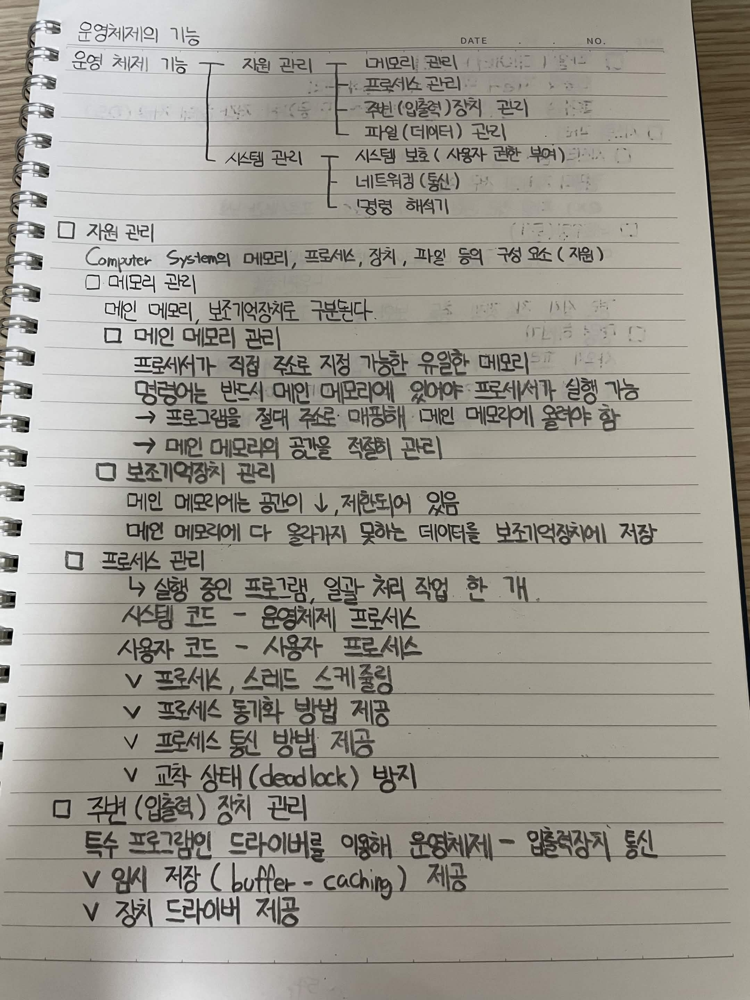
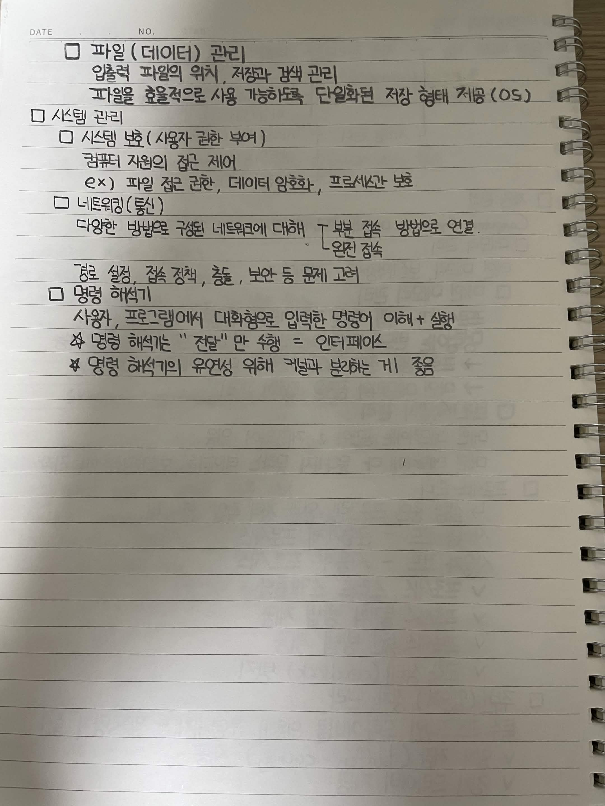

# 운영체제의 기능

운영체제는 컴퓨터 시스템의 자원을 관리하고, 사용자와 하드웨어 사이에서 필요한 기능을 제공한다.

## 운영 체제 기능

### 자원 관리

컴퓨터 시스템의 메모리, 프로세스, 장치, 파일 등의 구성 요소(자원)를 관리한다.

#### 메모리 관리

메인 메모리, 보조기억장치로 구분된다.

##### 메인 메모리 관리

프로세서가 직접 주소 지정 가능한 유일한 메모리

명령어는 반드시 메인 메모리에 있어야 프로세서가 실행 가능

→ 프로그램을 절대 주소로 매핑해 메인 메모리에 올려야 함

→ 메인 메모리의 공간을 적절히 관리

##### 보조기억장치 관리

메인 메모리에는 공간이 제한되어 있음

메인 메모리에 다 올라가지 못하는 데이터를 보조기억장치에 저장

### 프로세스 관리

→ 실행 중인 프로그램, 일괄 처리 작업 한 개

시스템 코드 → 운영체제 프로세스

사용자 코드 → 사용자 프로세스

* 프로세스, 스레드 스케줄링
* 프로세스 동기화 방법 제공
* 프로세스 통신 방법 제공
* 교착 상태(deadlock) 방지

### 주변 장치(입출력) 장치 관리

특수 프로그램인 드라이버를 이용해 운영체제 ↔ 입출력 장치 통신

* 임시 저장(buffer-caching) 제공
* 장치 드라이버 제공

### 파일(데이터) 관리

입출력 파일의 위치, 저장과 검색 관리

파일을 효율적으로 사용할 수 있도록 단일화된 저장 형태 제공(OS)

## 시스템 관리

### 시스템 보호(사용자 권한 부여)

컴퓨터 자원의 접근 제어

예)

* 파일 접근 권한
* 데이터 암호화
* 프로세스 보호

### 네트워킹(통신)
다양한 방법으로 구성된 네트워크에

* 부분 접속 방법으로 연결
* 완전 접속

경로 설정, 접속 정책, 충돌, 보안 등 문제 고려

### 명령 해석기

사용자, 프로그램에서 대화형으로 입력한 명령어 이해 + 실행

명령 해석기는 "전달"만 수행 = 인터페이스

명령 해석기의 유연성을 위해 커널과 분리하는 게 좋음

